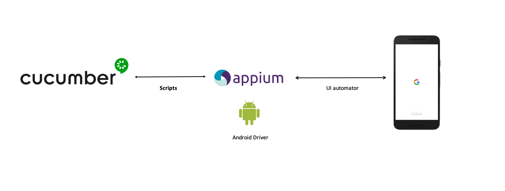

Build status:
https://app.bitrise.io/app/d9ceab91286794be/status.svg?token=zSpveXrg9JoguUP0-dQDug&branch=master

Scenarios contained in feature files written in Gherkin language.
Available scenarios can be found
[here](ios-scenario-testing/src/test/resources/io/cucumber).

Defined for the [ownCloud iOS app](https://github.com/owncloud/ios)


## Global architecture

- Scenarios are defined with [Gherkin
Syntax](https://cucumber.io/docs/gherkin/).

- Steps are interpreted by [Cucumber](https://cucumber.io/).

- Step implementation language:
[Java](https://docs.oracle.com/javase/7/docs/)

- Device interaction with [Appium](http://appium.io/)



## Get the code

- With git:

`git clone https://github.com/owncloud/ios-scenario-testing.git`

- Download a [zip
file](https://github.com/owncloud/ios-scenario-testing/archive/master.zip)

## Requirements

Different requirements:

* `Appium` instance running and reachable

* At least, one device attached and reachable via adb. Check command
`adb devices` to ensure `Appium` will get the device reference to
interact with it

## How to test

The script `executeTests` will launch the tests. The script needs some
parameters:

     -s (mandatory): URL of ownCloud server to test against
     -a (optional): Appium server URL. if Appium Server is not
specified, will be used "localhost:4723/wd/hub"
     -t (optional): Filter based in tags. F. ex: @createfolder will send
only tests tagged with such label. Tags are allowed to concatenate,
sepparated by ",". It is also allowed to use a classpath to execute all
the test in any class
     -d (optional): In case of several devices attached, tests will be
sent against the UID set in this option. This is the id returned by `adb
devices` command.
     -h: display this help

The execution will display step by step how the scenario is being executed.

## Test filtering

The way to filter which tests are executed is by tag. Tests can be
tagged as well as feature files

Using the `-t` option with the `executeTests` script is the way to do:

With a tag just above the scenario definition, it is posible to select
which scenarios will be tested:

```
   @share
   Scenario Outline: Correct share with user
     When user selects Documents to share with user2
     Then user user2 has access to Documents
     And share is created on Documents with the following fields
       | user | user2 |
```

Then...

````
./executeTests -s <server URL> -t @share
````

will trigger only the tests which are tagged with `share`

The tag set on the top of the feature file will involve all the tests
inside the feature file

More than one tag is allowed (separated with `,`):

````
./executeTests -s ... -t @share,@delete
````

The meaning is OR. All tests that are tagged with, at least, one of the
tags will be executed

More info in [Cucumber reference](https://cucumber.io/docs/cucumber/api/)

## Results

In the folder `target`, you will find a report with the execution results

**Note**: This repository was forked from [Cucumber-java
skeleton](https://github.com/cucumber/cucumber-java-skeleton)
repository, which contains the base skeleton to start working.