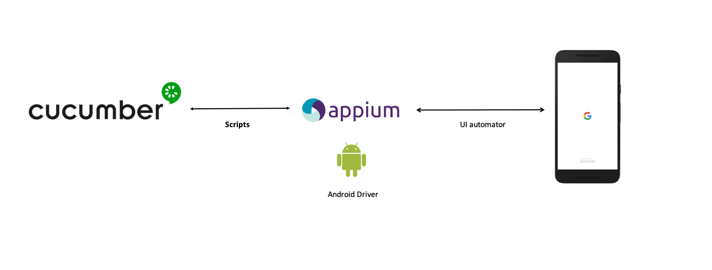

# iOS Scenario Testing

<!-- OSPO-managed README | Generated: 2026-04-16 | v2 -->

[](LICENSE) [](https://kiteworks.com/opensource)

End-to-end test automation framework for the ownCloud iOS app, using Gherkin-syntax feature files processed by Cucumber with Appium for device and simulator interaction. Written in Java, this project defines and executes behavioral scenarios against the iOS app to verify functionality across releases.

## Part of the ownCloud Mobile Ecosystem

This repository provides automated scenario tests for the [ownCloud iOS app](https://github.com/owncloud/ios-app). Test results are published via [Cucumber Reports](https://reports.cucumber.io/).

## Getting Started

Follow the steps below to set up and run the end-to-end test suite.

### Prerequisites

- Java JDK
- Gradle
- Appium instance running and reachable
- iOS simulator attached and reachable
- The following libraries and dependencies to be installed:

	* `authorize-ios`: A little utility that pre-authorizes Instruments to run UIAutomation scripts against iOS devices
	* `ios-deploy` : Allows install and debug iOS apps from the command line
	* `ideviceinstaller`: A command-line application to manage apps on iOS devices
	* `ios-webkit-debug-proxy`: Allows to send commands to MobileSafari and UIWebViews
	* `ios-sim` : Simulator manager (start, launch...)

### Global architecture



### Running Tests

#### 1. Build app

First, build the [app](https://github.com/owncloud/ios-app) from the expected branch/commit to get the test object, by using the [buildapp](https://github.com/owncloud/ios-scenario-testing/blob/master/buildapp/buildapp.sh) script in the current repository.

The [buildapp](https://github.com/owncloud/ios-scenario-testing/blob/master/buildapp/buildapp.sh) script:

- will disable welcome wizard
- will disable the release notes
- will set basic auth as forced authentication method, required to execute the test suites
- will move the final artifact to the correct place (`/src/test/resources` folder in the current structure)

Check the script's variables for the proper setup in your own environment or CI system.

In the current repository there will be always an `owncloud.app` file located in `/src/test/resources`, as example or fallback.


#### 2. Execute tests

The script `executeTests` will launch the tests. The following environment variables must be set in advance

| Variable | Required | Default | Description |
|---|---|---|---|
| `$OC_SERVER_URL` | Yes | -- | ownCloud server URL to test against |
| `$APPIUM_URL` | No | `localhost:4723/wd/hub` | Appium server URL |
| `$UDID_DEVICE` | No | -- | Simulator UDID (from `xcrun simctl list`) |

The script needs some parameters. Check help `executeTests -h`

To execute all tests but the ignored ones (or any other tagged ones):

		export UDID_DEVICE=F10FFCD4-CE92-4F40-B246-9709A4D4086A
		export OC_SERVER_URL=https://my.owncloud.server
		export APPIUM_URL=localhost:4723
		./executeTests -t "not @ignore"

The execution will display step by step how the scenario is being executed.

More info in [Cucumber reference](https://cucumber.io/docs/cucumber/api/)

**NOTE**: Since there are two kinds of backends available (oC10, oCIS), not all tests are suitable to be executed over both. Those tests have been tagged with:

- `nooc10`: tests to be executed only over oCIS, not suitable for oC10.
- `noocis`: tests to be executed only over oC10, not suitable for oCIS.

It's important to execute the tests with the mentioned tags to avoid wrong positives. Example commands:

`./executeTests -t "not @ignore and not @noocis"`<br>
This command will execute tests that are not ignored and suitable for oCIS. If this command is run over an oC10 instance, some tests will fail.

`./executeTests -t "not @ignore and not @nooc10"`<br>
This command will execute tests that are not ignored and suitable for oC10. If this command is run over an oCIS instance, some tests will fail.

## Documentation

- [Gherkin Syntax Reference](https://cucumber.io/docs/gherkin/)
- [Appium Documentation](http://appium.io/)

## Version Matrix

| Component | Version |
|---|---|
| Cucumber | 7.21.1 |
| Appium | 2.18.0 |
| Appium XCUITest Driver | 7.26.4 |
| Java Client | 9.4.0 |


## Community & Support

**[Star](https://github.com/owncloud/ios-scenario-testing)** this repo and **Watch** for release notifications!

- [ownCloud Website](https://owncloud.com)
- [Community Discussions](https://github.com/orgs/owncloud/discussions)
- [Matrix Chat](https://app.element.io/#/room/#owncloud:matrix.org)
- [Documentation](https://doc.owncloud.com)
- [Enterprise Support](https://owncloud.com/contact-us/)
- [OSPO Home](https://kiteworks.com/opensource)

## Contributing

We welcome contributions! Please read the [Contributing Guidelines](CONTRIBUTING.md)
and our [Code of Conduct](CODE_OF_CONDUCT.md) before getting started.

### Workflow

- **Rebase Early, Rebase Often!** We use a rebase workflow. Always rebase on the target branch before submitting a PR.
- **Dependabot**: Automated dependency updates are managed via Dependabot. Review and merge dependency PRs promptly.
- **Signed Commits**: All commits **must** be PGP/GPG signed. See [GitHub's signing guide](https://docs.github.com/en/authentication/managing-commit-signature-verification).
- **DCO Sign-off**: Every commit must carry a `Signed-off-by` line:
  ```
  git commit -s -S -m "your commit message"
  ```
- **GitHub Actions Policy**: Workflows may only use actions that are (a) owned by `owncloud`, (b) created by GitHub (`actions/*`), or (c) verified in the GitHub Marketplace.

## Security

**Do not open a public GitHub issue for security vulnerabilities.**

Report vulnerabilities at **<https://security.owncloud.com>** -- see [SECURITY.md](SECURITY.md).

Bug bounty: [YesWeHack ownCloud Program](https://yeswehack.com/programs/owncloud-bug-bounty-program)

## License

This project is licensed under the [MIT](LICENSE).

## About the ownCloud OSPO

The [Kiteworks Open Source Program Office](https://kiteworks.com/opensource), operating under
the [ownCloud](https://owncloud.com) brand, launched on May 5, 2026, to steward the open source
ecosystem around ownCloud's products. The OSPO ensures transparent governance, license compliance,
community health, and sustainable collaboration between the open source community and
[Kiteworks](https://www.kiteworks.com), which acquired ownCloud in 2023.

- **OSPO Home**: <https://kiteworks.com/opensource>
- **GitHub**: <https://github.com/owncloud>
- **ownCloud**: <https://owncloud.com>

For questions about the OSPO or licensing, contact ospo@kiteworks.com.

### License Migration to Apache 2.0

The OSPO is driving a strategic relicensing of ownCloud repositories toward the
[Apache License 2.0](https://www.apache.org/licenses/LICENSE-2.0), following
the [Apache Software Foundation's third-party license policy](https://www.apache.org/legal/resolved.html).

Individual repositories will migrate as their audit is completed. The LICENSE file
in each repo reflects its **current** license status (not the target).

**Current license: MIT** (Category A per Apache policy -- permissive, compatible with Apache-2.0).

Migration prerequisites for this repository:

- **CLA/DCO coverage**: All past contributors must have signed agreements permitting relicensing
- **Header updates**: All source file headers must be updated from MIT to Apache-2.0 notice
- **Dependency audit**: Verify no incompatible transitive dependencies
